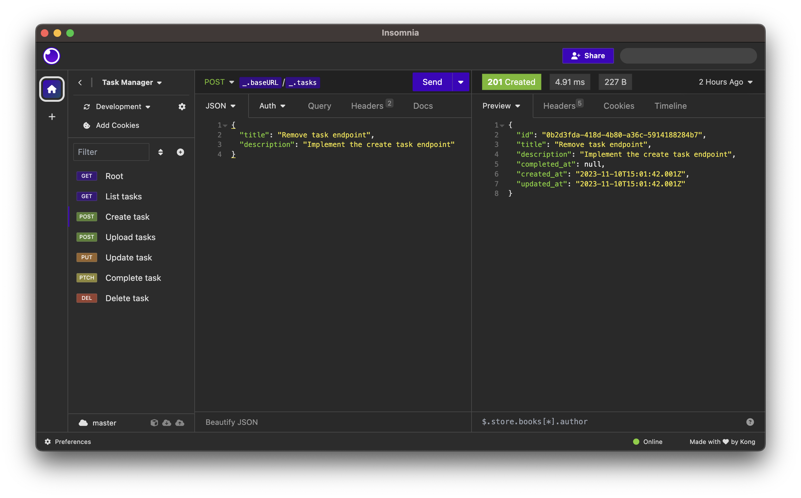

# Task Manager API

This is a **simple** Task Manager API built with Node.js. It provides endpoints for managing tasks.



## Running the Project

To run the project, you need to have Node.js installed. Then, you can run the following commands:

```bash
npm install
npm start
```

This will start the server on localhost:3000.

## Testing
To run the tests, you can use the following command:

```bash
npm test
```

## API Specs

The insomnia collection is available at [docs/insomnia-collection.yaml](docs/insomnia-collection.yaml).

### API Version

`GET /`

Returns the current version of the API.

### Tasks

`GET /tasks`

Returns a list of tasks. You can provide a `search` query parameter to filter tasks by title and description.

`POST /tasks`

Creates a new task. The request body should be a JSON object with `title` and `description` properties.

`PUT /tasks/:id`

Updates a task. The request body should be a JSON object with `title` and `description` properties.

`DELETE /tasks/:id`

Deletes a task.

`PATCH /tasks/:id/complete`

Marks a task as completed or uncompleted.

### Task Upload

`POST /tasks/upload`

Uploads tasks from a CSV file. The request should be a `multipart/form-data` request with a `file` field.

